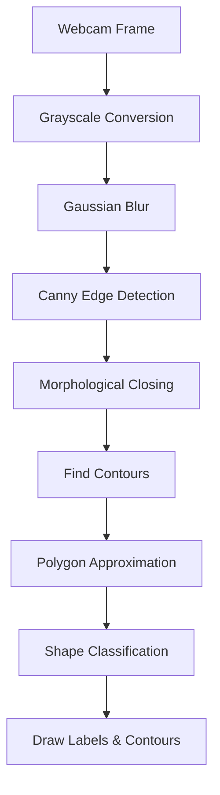

# 🔺 Real-Time Basic Shape Detection

This project implements a **real-time basic shape detection system** using **Python and OpenCV**.
It captures live webcam video, processes frames using computer vision techniques, detects geometric shapes, and labels them automatically.

The system can identify:

* 🔺 Triangle
* ⬛ Square
* ▭ Rectangle
* ⭕ Circle
* 🔷 Pentagon
* 🔶 Polygon

---

## 🚀 Features

* Real-time webcam-based shape detection
* Edge detection using Canny algorithm
* Noise reduction using Gaussian Blur
* Morphological operations for cleaner contours
* Contour approximation using Douglas-Peucker algorithm
* Shape classification based on:

  * Number of vertices
  * Aspect ratio
  * Circularity
* Live contour drawing and labeling

---

## 📌 Technologies Used

* Python
* OpenCV
* NumPy
* Computer Vision techniques

  * Edge Detection
  * Morphological Transformations
  * Contour Detection
  * Polygon Approximation

---

## 🧠 How It Works (Pipeline)

1. **Capture Webcam Frame**

   * Reads live video feed from webcam

2. **Preprocessing**

   * Converts frame to grayscale
   * Applies Gaussian Blur to remove noise

3. **Edge Detection**

   * Uses Canny Edge Detection to extract edges

4. **Morphological Processing**

   * Applies Morphological Closing
   * Fixes broken edges and small gaps

5. **Contour Detection**

   * Finds object boundaries from processed image

6. **Shape Approximation**

   * Simplifies contours into polygons
   * Counts vertices

7. **Shape Classification**

   * Triangle → 3 vertices
   * Square/Rectangle → 4 vertices
   * Pentagon → 5 vertices
   * Circle → High circularity
   * Polygon → Other irregular shapes

8. **Visualization**

   * Draws contour around detected shape
   * Displays detected shape name

---

## 📂 Project Structure

```text
.
├── main.py          # Main shape detection script
├── README.md
```

---

## 🛠️ Requirements

* Python 3.7+
* OpenCV
* NumPy

Install dependencies:

```bash
pip install opencv-python numpy
```

---

## ▶️ How to Run

```bash
python main.py
```

Press:

```text
q
```

to quit the application.

---

## 🔄 Processing Flow



---

## 🧮 Shape Detection Logic

### 🔺 Triangle

Detected when:

```python
vertices == 3
```

---

### ⬛ Square / ▭ Rectangle

Detected when:

```python
vertices == 4
```

Uses aspect ratio:

```python
aspect_ratio = width / height
```

* Ratio ≈ 1 → Square
* Otherwise → Rectangle

---

### 🔷 Pentagon

Detected when:

```python
vertices == 5
```

---

### ⭕ Circle

Uses circularity formula:

```python
circularity = 4 * π * area / perimeter²
```

* Circularity > 0.75 → Circle

---

## 📊 Detected Shapes

| Vertices | Shape |
|----------|-------|
| 3 | Triangle |
| 4 | Square / Rectangle |
| 5 | Pentagon |
| Many + High Circularity | Circle |
| Many + Low Circularity | Polygon |

---

## 📷 Example Output

### 🎥 Real-Time Shape Detection Demo

https://github.com/user-attachments/assets/68f857f4-2234-4fc2-8489-03e8aa5404a6

---

### ✅ Detection Preview

* Green contour → Detected boundary
* Blue text → Shape name

```text
Triangle
Rectangle
Circle
Square
Pentagon
```

---

## 🖥️ Console Output

```text
Press 'q' to quit
```

---

## ⚙️ Important Parameters

### Canny Edge Thresholds

```python
cv2.Canny(image, 50, 150)
```

Controls edge sensitivity.

---

### Shape Approximation Accuracy

```python
0.03 * perimeter
```

* Smaller value → More detailed contour
* Larger value → Simpler contour

---

### Area Filtering

```python
if area < 2000:
    continue
```

Ignores tiny noisy objects.

---

## 🧩 Possible Enhancements

* 🎯 Hexagon detection
* 🎨 Color detection
* 📦 Object tracking
* 🧠 AI-based shape classification
* 📏 Distance & size measurement
* 🔍 Better circle detection using Hough Transform
* 📷 Image upload support
* 🖥️ GUI application

---

## ⚠️ Notes & Limitations

* Works best with:

  * Good lighting
  * Clear object boundaries
  * Minimal background noise

* Very small objects may be ignored
* Overlapping shapes may reduce accuracy
* Perspective distortion can affect detection

---

## 📚 Concepts Used

This project demonstrates important computer vision concepts:

* Image Preprocessing
* Edge Detection
* Morphological Operations
* Contour Analysis
* Polygon Approximation
* Shape Classification

---

## ❤️ Acknowledgment

Built using:

* OpenCV
* NumPy
* Python Computer Vision techniques

---
